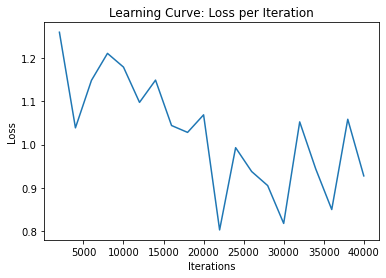

# CSC413-KonosubaNet

# Introduction

The goal of the project is to make a generative text model. The model is fed excerpts from the web novel series, KonoSuba, and tries to generate text mimicking the writing style of the training data, and generate texts of two to three paragraphs long (character-level RNN). Inputs are texts from the novel series and output are texts of the same nature, which ideally includes narration and dialogues.

# Model
We decided to use a transformer model. The model takes in a sequence of characters as inputs and outputs a sequence of probabilities for the next character. The implementation of our model is based on the implementation from http://peterbloem.nl/blog/transformers. However, instead of using the self-attention module written in the blog, we use PyTorch's MultiheadAttention, and we use positional encoding (implementation from https://pytorch.org/tutorials/beginner/transformer_tutorial.html) instead of positional embedding. The three main hyperparameters of our model architecture are **k**, **h**, and **d**. **k** is the embedding size, and the input, output size of most layers in the architecture. **h** is the number of heads in the Multihead Attention layer. **d** is the depth or the number of transformer blocks in the model.

This is an overview of the model

The characters first get passed through an embedding layer, and then the positional encoding is added to the embeddings. The inputs are then passed through a series of transformer blocks before the final layer converts the inputs to logits, which is then soft maxed to get the probabilities of the next character. The inputs are size **NxS**, where **N** is the batch size, and **S** is the sequence length. The outputs are size **NxSxvocab_size**.

This is the architecture of each transformer block.

There is a skipped connection between the multiheaded attention layer, and between the MLP layer. The MLP is two layers of size **4k**. The inputs and outputs are size **NxSxk**.

Lastly, we use pytorch's MultiheadAttention to implement our attention mechanism.

Query, Key, Value are three linear layers with output size **k**. MutiheadAttention then takes them as parameters, partitioning the **k** inputs by **h**. So **k** needs to be divisible by **h**. Attention is then applied to the **h** sections, with a final layer unifying the heads. We also include an upper-trianglular attention mask as a parameter to make the mechanism autoregressive. The inputs and outputs are both size **NxSxk**.

## Model parameters
outside of the transformer block, the character embedding has **kx(vocab_size)** parameters, since it has **vocab_size** many inputs, and **k** outputs. Similary, the final output layer has **(vocab_size+1)k** parameters (the +1 is from the bias). The positional encoding does not have any learnable parameters. 

Inside the transformer block, *toquery*, *tokey*, *tovalue* are three linear layers with input, ouput size of *k*, and without bias. So they have **kxk** parameters each. For every head, **Wq, Wk,Wv** are all size **(k/h)x(k/h)**. Since there are **h** heads, and a final unifying layer at the end, the multihead attention layer has **hx(k/h)x(k/h) + kxk** parameters. Each layer normalization has 2 learnable parameters. The MLP consists of one layer with (input,output) **(k,4k)**, and another with **(4k,k)**. So from both layers, there are **4kxk + 4k + 4kxk +k** parameters. Finally, our model has **d** transformer blocks, so in total we have

**kx(vocab_size) + (vocab_size+1)k + d(4+12kxk+kxk/h + 5k)** parameters.

We decided to use a model of size **k=256,h=8,d=1**. The vocab size was **54**, so our model has **823,812** learnable parameters.

## Model Examples
Please check *output_successful.txt* and *output_unsuccessful.txt*

We pick the one that makes the most sense and has fewer grammatical error output as successful, which comes from 298 training epoch.

The unsuccessful one come from epoch 32, it has several grammatical error and sometime includes the special charater "-" in between words.

# Data
## Data Source

The data for this project, being the mainline volumes of “KonoSuba: God's Blessing on this Wonderful World!”, was taken from a fan translation website that hosted full translation for all 17 volumes (as well as side stories and spinoffs that were not used in this project). 

Besides containing complete translations of all novels, the source site also formatted all text in a consistent system. To go into specifics, the hierarchy of volumes, chapters, parts, and lines (referred to as “sentences” in the proposal), present in how our data was prepared and formatted, was the very same system used in the source. Parts are clearly separated by headers (and chapters split across different web pages). Consecutive sentences of dialogue spoken by a single character were grouped into single lines and line breaks clearly distinguish differing lines. 

All lines also have consistent grammatical formatting (with only a few exceptions), with dialogue always starting with double quotations and translator’s notes always starting with angle brackets. As a consequence of this grouping, lines were able to be cleanly grouped and tagged, which allows the filtering of irrelevant text (this will be discussed further in Data Transformation/Formatting). 

## Data Statistics (Data Summary)

*Note: the full raw statistical numbers can be found in the stats.txt file.*

In total, all 17 volumes of the “KonoSuba” light novels were used for this project. This includes 4,148,014 characters found within 754,749 words split across 45,030 lines (which are scattered across 610 parts in 116 chapters). An average of 92 characters appear per line and 5.5 per word. An average of 16.5 words appear per line.

102 unique characters appear throughout the dataset forming 17,413 unique words. Of the 102 characters, 20 are non-standard, which in this context is defined as not appearing on an US keyboard. There were only 15,484 occurrences of these non-standard characters, making up less than 0.4% of all characters in the dataset. The 100 most common words (which makes up less than 1% of all unique words) make up more than 50% of all words in the set.

The following are distributions of all unique characters and the 100 most common words in the dataset (it is recommended to view the graphs themselves for full resolution):

*Note: The word in 33rd place appears blank. This appears to be an issue of whitespace being counted as words and so can (and should) be ignored.*

## Data Transformation/Formatting

The transformation of data into a workable format could be separated into three distinct steps. Steps 2 and 3 are fully automated via a custom tool written specifically for this express purpose (this will be elaborated on in steps 2 and 3).

The first step was scraping the data from the web source. Unfortunately, various issues led to the automation of this step infeasible. Besides needing to remove part headers and skip art that appears periodically through the text, later volumes included anti-scraping measures in the form of white text hidden in empty lines (like watermarks). There were also occasional formatting inconsistencies, such as the inclusion of line breaks that included whitespace (which caused lone whitespace to appear as lines) and translation notes being delimited with curly braces. Volumes 10 and 11 were also hosted on a different site and so had slightly differing formatting. All of these issues had to be detected and corrected manually.  
Manually scraping the data involves copying all novel text to a plaintext document while making sure watermarks, extraneous whitespace, and headers are not included. Side stories (which are typically narrated by a different character) and author’s notes should be avoided. Every part, chapter, and volume must also be separated by a respective delimiting string for the automated tool (used in steps 2 and 3). Details about what that is can be found in the documentation of the automated tool.

The second step is the preparation of data into a more machine friendly format. Included in the repo is an automated tool (written in Javascript with an HTML interface), called the “dataConverter”, which handles this step. The details of how to do this can be found within the documentation of the tool, which is included in the tool interface itself (and in the README for the tool).  
Broadly speaking, it involves sending a fully formatted data text file from step 1 through the tool to produce an equivalent JSON file. The JSON files makes manipulation of lines easier and includes a tagging system that, taking advantage of the consistent grammatical formatting, tags each line as either narration, dialogue, quotation, or tlnote (translator’s note). The process also cleans out extra line breaks, Windows carriage returns (the \r character), and replaces the directional curly quotation marks with non-directional quotations (both double and single).

This JSON file is then used in the third step, where the data is converted into a consistent format, usable by the model. This data processing step is also done via the automated tool with the details of how to do this being found within documentation. In addition, the option to filter out the translator’s notes should be enabled (as it is by default), as the TL notes is not to be used as part of the model. The ending format, as used in this project, is a human-readable format where lines are separated by single line breaks (\n) and parts are separated by double line breaks (\n\n). Chapters and volumes are not used.

The statistics about the dataset was accumulated via the automated tool as well. Instructions for how to use the analysis part can also be found in documentation.

## Data Splitting

Data spitting does not apply to our project.

## Data creation

The actual data points we used to train the model are samples of the entire text with different line lengths. We first read the entire text, and split it by lines. We then partition the texts by varying line lengths. We remove samples that start with the same line since if there are two or more data points that start with the same line, but end at different lines, then the model cannot optimize for all the data points. 

# Training
## Training Curve

## Hyperparameter Tunning
For our model, we tuned the following hyperparameters: batch size, learning rate, depth of model, number of heads, and k.

For the learning rate, we initially use 0.001, the default from adam optimizer. Then we want to try a larger learning rate to speed up the training process. With 0.01, the model did not learn well and output garbage words such as (hell# w!fld). We also tried a smaller learning rate of 0.0008, which performs equally well as 0.001, slightly better than 0.001. It seems like increasing the learning rate from 0.0008 to 0.001 did not affect much the model training speed and performance.

For depth, a larger depth will result in the model requiring more time to train for each epoch and more computing memory.  Our model is using depth 1, but the largest we could try is 2, otherwise, we run into a memory issue.

For head and k, heads need to be divisible by k. The largest heads we could try is 256. Larger heads mean a more complex model, which should yield better output.

For batch size, we tried 1,2,4, and 8. With heads 256, we run out of memory when batch size equals to 8. So the largest batch size we could have is 4. More heads means more trainable units, which consume more memory. When we reduced heads to 128, we were able to use a larger batch size. The larger the batch size, the faster will be the training speed (parallel training).

# Results
## Quantitative Measures
We are using bleu score as a quantitative measure. It computes the common words/sentences between each corpus (using a smoothing function).
We tried using several bleu score functions from different librairies. 

bleu score from torchtext always returns 0 (since it takes 2 paragraphs and only compares sentence wise)

corpus_bleu from nltk.translate.bleu_score with different smoothingfunction, method7 leads the best score and is what we are using with our model.

sentence_bleu from nltk.translate.bleu_score takes 2 sentences and compare word-wise. We are not using this one since some sentences only contains 1 word (e.g. “hmmm”), which will get a perfect score. This kind of perfect score is meaningless. 

## Quantitative and Qualitative Results

After 300 epochs of training, the model is relatively good at generating some texts. Since we are trying to generate new texts, we do not have a test set to validate our outputs. In our case, we are using human interpretation as a method of interpreting the result qualitatively. 

From the output_successful.txt, we can see that our model is relatively good at constructing part of a sentence. For instance, in line 9, we see "Hey, are you sure that a war ….”. Although the reset of the sentence does not have any meaning at a human-readable level, we succeed at generating part of a meaningful sentence. In addition, our models will take care of verb tenses. Verbs following a third-person singular subject will have an “s” at the end. For example, in line 2, “... she [starts] at the others that [accentuates] at all”. Also, we can tell that the generated text is a combination of narration and dialogues (which start with a quotation mark).

It is very hard to determine whether the output texts follow the novel author’s writing style. Since most of the sentences are not grammatically correct and are only partially meaningful. However, with the use of words, we can say that it should come from a novel (and not journal articles, poems, etc.). 

To see how the model performs, we create a Google form (https://forms.gle/ysc9TBQQcJPQ5DUPA) to test whether people are able to distinguish machine-generated text from the original text. 

As shown in the above table, we see that all 15 people are good at distinguishing original text with an average of 12/15 correct answers at the original text. Among the 5 machine-generated text, there are 2 pieces where people have a harder time getting the correct answer (where 1 of them is our output_successful.txt). 10/15 of the people think that the output_successful.txt is from the original text. This shows that our model is able to generate texts that somehow mimic real novels. However, it is still hard to say whether it is good at impersonating the original author since 9/15 has never heard of this novel/anime and 0/15 has read the novel.

To see detailed statistics, visit here (https://docs.google.com/forms/d/1itpg5W2ErG3nSWjDdx2hiAEAOM9jbeMzuO5fWgqBHx0/edit#responses).

When analyzed from a qualitative point of view, our use of the bleu score is not a perfect choice. Usually, bleu score is comparing output from a model and some reference texts. In our case, we don’t have a reference text. We trained our model using the 17 volumes of the novel, comparing our model with the 18th volume is not a good way to conclude whether our model performed well or not. Our bleu score function is comparing every 10 sentences of the novel (starting from volume1) to every 10 sentences of the generated text. The score we get at epoch 300 is 0.082595. 

From the following graph, we see that the bleu scores are iterating mainly between 0.05 and 0.15. Bleu scores are not positively correlated with epochs, it does not always increase as epoch increases. This can be explained by the definition of bleu score, which usually compares the generated text with a single truth. Since we are only comparing how close is our output from the training data, then the shape of this graph can be explained.

## Justification of Results

# Ethical Concerns
Training deep learning models with novel text could be in some sense, violating author copyright. In our case, the model is not for commercial use and stays within our group (un-published to the public), but it could be potentially used by malicious people. In that case, training data that we get from the internet violates the author’s copyright as it becomes for commercial use.

Other than the limitation of training data, using our model to generate text should not cause any harm to the public, however, it could be possible that some malicious users are now able to impersonate the author’s writing style. Potentially, someone could come up with writings that are not originally from the author and publish those online and pretend to be the author.
Impersonating is a huge issue, with some minor changes in the code and different input text files, we are potentially able to train different models that could impersonate other writing style. For instance, this kind of model can be used to impersonate students not living with their parents, and ask for tuition on their behalf. This kind of impersonation and fraud is problematic

In addition, if our model falls into the novel's author’s hands, then he could potentially use this model to write sequels, which take away the author’s autonomy. 

# Authors
Sally Zhu (ethical concerns, interpret results, exaplin training hyperparamters)

Yuan Bo Lai (implement bleu_score, train model, tune hyperparameter)

Allen Yao (Get training data, formatting training data)

Yue Ran Ma (writting Transformer model code, train model, tune hyperparameter, draw model graphs)
